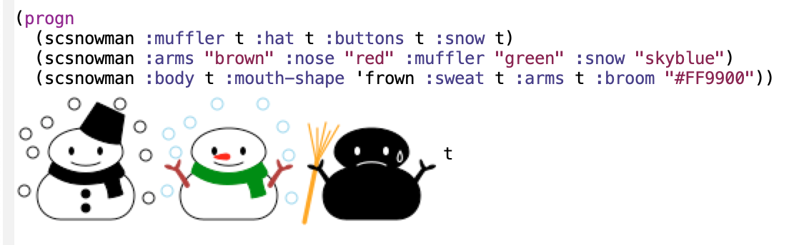

# scsnowman.el
scsnowman.el is a Emacs Lisp port of LaTeX [scsnowman.sty](https://github.com/aminophen/scsnowman).

You can insert many variants of snowman to buffer in graphical Emacs.

## Screenshot


## Usage
You can insert scsnowman to buffer simply by calling `scsnowman` function.
```elisp
(scsnowman :mouth-shape 'frown :snow "skyblue" :sweat t)
```

In scsnowman.el scsnowman is a SVG object derived from svg.el (which is added in Emacs 26.1).

The function `scsnowman-create` creates a scsnowman SVG object, which can be used by several functions from svg.el such as `svg-image` and `svg-print`.

To get image descriptor:
```elisp
(svg-image (scsnowman-create))
;; => (image :type svg :data "<svg width=\"100\" height=\"100\" version=\"1.1\" xmlns=\"http://www.w3.org/2000/svg\" stroke-linejoin=\"round\" stroke-linecap=\"round\" fill=\"transparent\"> <path d=\"M50 28 C 64 28, 76 35, 76 45 C 76 49, 72 53, 67 56 C 79 59, 84 68, 84 75 C 84 87, 75 92, 68 92 L32 92 C 25 92, 16 87, 16 75 C 16 68, 21 59, 33 56 C 28 53, 24 49, 24 45 C 24 35, 36 28, 50 28 Z\" fill=\"transparent\" stroke=\"black\"></path> <ellipse cx=\"40\" cy=\"44\" rx=\"2\" ry=\"3\" fill=\"black\"></ellipse> <ellipse cx=\"60\" cy=\"44\" rx=\"2\" ry=\"3\" fill=\"black\"></ellipse> <path d=\"M40 52 C 45 55, 55 55, 60 52\" stroke=\"black\"></path></svg>" :scale 1)

;; you can insert the image with got image descriptor
(insert-image (svg-image (scsnowman-create)))
```

To print SVG source:
```elisp
(svg-print (scsnowman-create :body t :arms t :hat t :muffler "blue"))
```

## Extensibility
As well as original scsnowman.sty you can define and use custom scsnowman shapes.
Use `scsnowman-define-shape-function` macro to define custom shapes.
This macro defines a new function named `scsnowman--shape-<name>` which is used by `scsnowman-create`.
```elisp
;; define a shape named myfavorite
(scsnowman-define-shape-function "myfavorite"
  (let ((svg (svg-create 100 100)))
    ;; define scsnowman SVG
    ;; you can use `body', `eyes', `nose'... arguments in this form
    ;; useful scsnowman attributes such as `body-path', `eye-path'... also can be used

    ;; make sure to return created SVG
    svg))

;; use myfavorite shape
(scsnowman :shape "myfavorite")
```
By default scsnowman.el has "narmal" shape ported from [scsnowman-normal.def](https://github.com/aminophen/scsnowman/blob/master/scsnowman-normal.def).
Please refer it.


## scsnowman.el examples
### scsnowman-replace-snowman-mode
Replace ☃(U+2603), ⛄(U+26c4) and ⛇(U+26c7) characters in the viewing buffer with scsnowman images.

```elisp
(defvar scsnowman-replace-snowman-alist
  `(("☃" . (svg-image (scsnowman-create :muffler t :snow t) :scale 0.2 :ascent 80))
    ("⛄" . (svg-image (scsnowman-create :muffler t) :scale 0.2 :ascent 80))
    ("⛇" . (svg-image (scsnowman-create :body t :muffler t :snow t) :scale 0.2 :ascent 80))))

(define-minor-mode scsnowman-replace-snowman-mode
  "Toggle SCsnowman replace snowman mode."
  :lighter " SCsnowman"
  :global nil
  (if scsnowman-replace-snowman-mode
      (let* ((light-p (eq (frame-parameter nil 'background-mode) 'light))
             (scsnowman-defaultcolor (if light-p "black" "white"))
             (scsnowman-defaultanticolor (if light-p "white" "black")))
        (save-excursion
          (dolist (snowman scsnowman-replace-snowman-alist)
            (goto-char (point-min))
            (while (search-forward (car snowman) nil t)
              (add-text-properties (car (match-data t)) (cadr (match-data t))
                                   `(display ,(eval (cdr snowman))))))))
    (save-excursion
      (dolist (snowman scsnowman-replace-snowman-alist)
        (goto-char (point-min))
        (while (search-forward (car snowman) nil t)
          (remove-text-properties (car (match-data t)) (cadr (match-data t))
                                  '(display nil)))))))
```

#### Example
Buffer contents:
```
あ、雪だるまだ☃

雪が降ってるね☃

⛄あっちは雪が降ってないみたい

！⛇大雪だ！
```
Screenshot after `M-x scsnowman-replace-snowman-mode`:


### Bouncing scsnowman
Please install [bouncing-dvd-logo.el](https://github.com/tsuu32/emacs-bouncing-dvd-logo) and make sure that Emacs loads bouncing-dvd-logo.el.

You can enjoy editing with boucing scsnowman ⛄︎

```elisp
(setq bouncing-dvd-logo-insert-form '(scsnowman :hat "green"
                                                :arms "brown"
                                                :muffler "blue"
                                                :buttons t
                                                :note t))
;; And M-x bouncing-dvd-logo-mode
```


